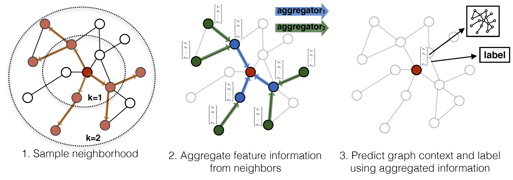

# SAGE-GRAPH-MxNet-R

This repo contains an MXNet implementation of [this](https://arxiv.org/pdf/1706.02216.pdf) state of the art Graph Convolutional Neural Network with R.


## Requirements
All examples use MxNet 0.10.1 library. To install the library, please type 
```
install.package("mxnet") 
```
in R Studio

## Running the code
Download & extract the training data:

Currently the examples in this directory are tested on the CORA dataset. The GraphSAGE model assumes that node
features are available.

The dataset can be found in example_data folder, and data are in CSV format

The following is the description of the dataset:
> The Cora dataset consists of 2708 scientific publications classified into one of seven classes.
> The citation network consists of 5429 links. Each publication in the dataset is described by a
> 0/1-valued word vector indicating the absence/presence of the corresponding word from the dictionary.
> The dictionary consists of 1433 unique words. The README file in the dataset provides more details.
## Results & Comparison
- Please run `main.R`
- This MXNet implementation achieves *NLL = 0.780* after 100 epochs on the validation dataset

## Hyperparameters

The default arguments in `main.R` achieve equivalent performance to the published results. For other datasets, the following hyper parameters provide a good starting point:
- K = 2
- hidden num  = {20,20}
- random neighbour sampling = {20,10}
- learning rate = 0.005
- Dropout after every layer =  0.3
- Epochs = 100+
